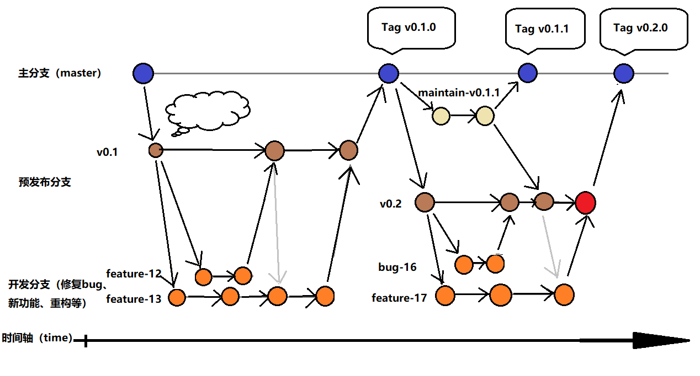

# 如何贡献我的源代码

`Shoulder` 欢迎各类型代码提交，不限于`优化代码格式`、`优化注释/JavaDoc`、`修复 BUG`、`新增功能`

# 导航
- [分支管理](#基础知识)
- [分支管理](#分支管理)
- [发布流程](#发布流程)
- [IED实用设置](#IED实用设置)

## 基础知识

 目前使用 `Git` 来控制程序版本，如果你想为 `Shoulder Framework` 贡献源代码，请先大致了解 Git 的使用方法。我们目前把项目托管在 `Gitee` 上，任何 Gitee 用户都可以向我们贡献代码。

 参与的方式很简单，
 - `fork` 一份 `Shoulder Framework` 的代码到你的仓库中
 - 修改后提交，并向我们发起`pull request`申请
 - 我们会及时对代码进行审查并处理你的申请并。审查通过后，你的代码将被 `merge` 进我们的仓库中，这样你就会自动出现在贡献者名单里了。

 我们希望你贡献的代码遵循常见的编码规范（如符合`阿里巴巴Java编码规范`，IDEA中可以选中特定包右键`Reformat Code`），最好附带单元测试代码~

## 分支管理

### 分支命名

【`1.0.0-RELEASE` 之前只有主分支】

- 开发分支（开发完毕合并至预发布分支 或 维护分支）
    - 新功能分支命名：
    feature-{issue编号}

    - 缺陷修复分支命名：
    bug-{issue编号}

    - 重构分支命名：
    refactor-{issue编号}

    - 改进分支命名：
    improvement-{issue编号}

- 预发布分支（单人开发时，开发分支与预发布分支为同一分支）
v{x.y.0}

- 发布分支（同 tag）：
release-v{x.y.z}

- 维护分支（基于发布分支）：
maintain-v{x.y.z}

- 创建 Tag（基于发布分支）：
v{x.y.z}.RELEASE

### 分支管理模型图：

---

## 克隆仓库与开发

1. Fork 本仓库
2. 新建 issue/{issue对应编号} 分支
3. 提交代码
4. 新建 Pull Request(建议PR前先 Merge)
5. 等待合并

## 发布流程

- **发布前（准备）**
    - 更新依赖版本
    - 更新发行版本号
    - 本地构建、测试
  - CHANGELOG、README 修订或使用工具 (TODO 优化:后续规范commit信息, 根据 commit 自动生成)

- **发布**
  - 推送到`Maven Central`，提交至代码库（git）并触发 CI flow
    - 打TAG，推到 github

- **发布后（清理）**
    - 在社交平台宣布发布一个新版本
    - pom.xml更新到下一个开发版本，推到github
    - 在web页面上更新版本
    - 在GitHub上更新发行说明
  - 关闭/创建里程碑、标签。(TODO 后续使用自动化工具如 spring 开源的 label robot)
  - 分支清理，删掉里程碑内的无用分支，包括开发分支（如：1.5/dev/lym/feature-1），发布分支
    - 在其他频道、社交平台上宣布发行

## 维护分支开发与发布
场景描述：已经发布`1.1.0.RELEASE`，但发现缺陷，需要发布`1.1.1.RELEASE`修复版本

1.	基于1.1.0分支创建1.1.x的维护分支：maintain/1.1.x，1.1.x版本后续所有维护修改均以该分支为基础开发，停止维护时删除该分支。
2.	在 `maintain/1.1.x` 上将版本修改为 `1.1.1-SNAPSHOT`，修复缺陷
3.	测试；通过后修改版本为 `1.1.1.RELEASE`
4.  将 `1.1.1.RELEASE` 的jar发布到maven仓库
5.  基于`maintain/1.1.x`分支创建`release/1.1.1`分支
6.	在 `release/1.1.1` 上创建tag `v1.1.1.release`
7.  删除 `release/1.1.1` 分支

注：
- 当`1.1.1-SNAPSHOT`再出现缺陷时，回到第2步直到7。
- 当1.1.x不再维护后，删除`maintain/1.1.x`分支

参考：[spring security 发布流程](https://github.com/spring-projects/spring-security/wiki/Release-Process)

----

## IED实用设置

#### 部分代码跳过格式化（spring security dsl）
IDEA：settings - Editor - Code Style - enable formatter marks in comments

#### `xxx.propreties` 文件中写入中文后保存乱码？或显示为 unicode 格式？

IDEA 可以为我们自动转化：
- 打开设置 `File -> Settings -> Editor -> File Encodings`
- 勾选 `Transparent native-to-ascii conversion`

gpg 发布错误
https://blog.csdn.net/u011781521/article/details/130454386
