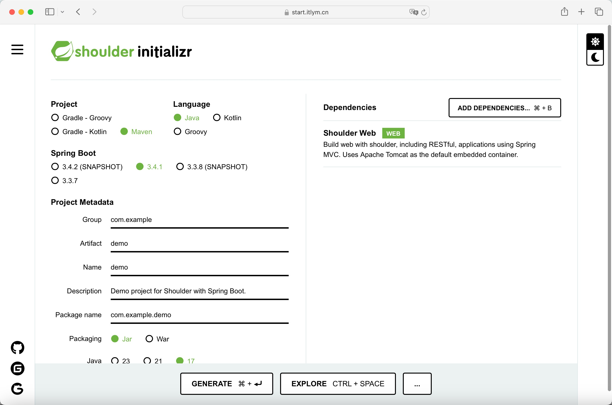

<h1 align="center"><a href="https://doc.itlym.cn/shoulder.html" target="_blank"></a></h1>

> Based on `Spring Boot` dedicated to simplify development, improve efficiency. Hope to become the best partner
> for `Spring Boot`.

[](https://github.com/ChinaLym/shoulder-framework/releases/tag/v1.1.0)
[](https://spring.io/projects/spring-boot)


# 📖Introduction [中文 language](README_zh.md)

`Shoulder Framework` is a plug-in for `Spring Boot` and provides some useful functions to speed up development! Some examples of functions:

- `AOP logging/exception handling`
- `One config switch to cluster mode`
- `Log tracking and collecting`
- `Multi-language / I18n`
- `Fully automatic dynamic dictionary`
- `Global ID Generator`
- `Unified message format`
- `Operation Audit`
- `Multiple verification codes`
- `Asynchronous upload and download`
- `Top Secret Communications`
- `Embedded DB / Redis`

### 🔥 Sample project: [GitHub](https://github.com/ChinaLym/shoulder-framework-demo), [Gitee](https://gitee.com/ChinaLym/shoulder-framework-demo)

### 🆚Compare with other web frameworks

- **More Secure**
- **Easy to expand**
- **High readability of user code**
- **Low maintenance cost**
- **Low start-up cost**
- **With specification**：**[Software Elegance Design and development best practices](https://doc.itlym.cn)**
- Not only **improve development efficiency**, but also **lower maintenance costs**!

---

# [🚀 Quick Start](https://start.itlym.cn)

## ✨ [Experience with a Demo](https://github.com/ChinaLym/shoulder-framework-demo/tree/main/demo1)

Just download and run the 👉 **[Demo](https://github.com/ChinaLym/shoulder-framework-demo/tree/main/demo1)** from
([github](https://github.com/ChinaLym/shoulder-framework-demo/tree/main/demo1)
or [gitee](https://gitee.com/ChinaLym/shoulder-framework-demo/tree/main/demo1)),
feel the elegant coding experience brought by `Shoulder`.

## 🔥 **[Create Project Online](https://start.itlym.cn)**



## ✨ Using in an existing `Spring-Boot` project

Just add the dependencies that you want to use into your `pom.xml` like this:

```xml
<dependency>
    <groupId>cn.itlym</groupId>
    <artifactId>shoulder-starter-web</artifactId>
    <version>1.1.1-SNAPSHOT</version><!-- shoulder-version -->
</dependency>
```

## ✈️ Via `maven-archetype`

1. Ensure you have already prepared `JDK17+` and `Maven` installed locally.

2. Run the command and create a project immediately.

```shell
mvn archetype:generate -DarchetypeGroupId=cn.itlym -DarchetypeArtifactId=shoulder-archetype-simple  -DarchetypeVersion=1.0.0  -DgroupId=com.yourcompany  -DartifactId=yourappName  -Dversion=1.0-SNAPSHOT
```

## 🧩 More..

> Manually、Spring CLI、IDEA、STS...

See in [doc.itlym.cn](https://doc.itlym.cn/shoulder_start.html])

---

# 🆚 VS Others

**More Security**、**Easier**：according to **[The_Best_Software Specification](https://doc.itlym.cn)**, Develop **Fast**
and make your code **Strong**!

# 🌛 Applicable scenarios

- `Graduation Project`, `Outsourcing Project`
- `Microservice base framework`
- `Internal framework development`

---

# ❓FAQ

See [FAQ Document](doc/faq.md)

More: [Ability.md](doc/ability-intro.md)、[Roadmap](ROADMAP.MD)

# ✈ Planning & Development Roadmap

`Shoulder` aims to be a complete re-usable platform (PaaS), where users only need to focus on their business logic. Here is the overall
outlook:

- `Shoulder iPaaS` iPaaS Basic middleware environment: Shoulder offers dependency middleware Docker images or deployment guides (e.g.,
  databases, message queues, service registration centers, task scheduling centers, search engines, alarm and monitoring systems, etc.).
- `Shoulder Specific` manuel of development, see *
  *[the best practices of elegant software design and development](https://doc.itlym.cn)**
- **Shoulder Framework**  This project, aims to encapsulation of common capabilities, reducing code redundancy and lowering system
  development and maintenance costs.
- `Shoulder Platform` General business platform, provides user platform, payment platform, notification center, business gateway, data
  dictionary, global ID generator, and other basic, common business capabilities.
- `Shoulder Platform SDK` Provides SDKs to facilitate business layer integration.

## Relevant Project
| Project Name                | Open Source URLs                                                                                                          | Description                                                                                        |
|-----------------------------|---------------------------------------------------------------------------------------------------------------------------|----------------------------------------------------------------------------------------------------|
| Shoulder Framework          | [github](https://github.com/ChinaLym/shoulder-framework)、[gitee](https://gitee.com/ChinaLym/shoulder-framework)           | a `Java WEB framework` based on `Spring Boot` while provides a set of common capabilities.         |
| Shoulder Platform           | [github](https://github.com/ChinaLym/shoulder-platform)、[gitee](https://gitee.com/ChinaLym/shoulder-platform)             | `SaaS platform`, provides user, payment, notification gateway and other common services...         |
| shoulder-framework-demo     | [github](https://github.com/ChinaLym/shoulder-framework-demo)、[gitee](https://gitee.com/ChinaLym/shoulder-framework-demo) | `Shoulder Framework` Demos                                                                         |
| shoulder-plugins            | [github](https://github.com/ChinaLym/shoulder-plugins)、[gitee](https://gitee.com/ChinaLym/shoulder-plugins)               | a `maven plugin` for `shoulder-framework` aiming reduce code.                                      |
| shoulder-lombok             | [github](https://github.com/ChinaLym/shoulder-lombok)、[gitee](https://gitee.com/ChinaLym/shoulder-lombok)                 | a `library` based on `lombok`，provide an annotation `@SLog` to simplify code.                      |
| shoulder-lombok-idea-plugin | [github](https://github.com/ChinaLym/lombok-intellij-plugin)、[gitee](https://gitee.com/ChinaLym/lombok-intellij-plugin)   | a `IDEA plugin` based on `lombok-idea-plugin`, to support `@SLog` in `IDEA`.                       |
| Shoulder iPaaS              | [github](https://github.com/ChinaLym/shoulder-ipaas)、[gitee](https://gitee.com/ChinaLym/shoulder-iPaaS)                   | `iPaaS platform`，introduces how to deploy common middlewares, monitoring systems, basic platforms. |
| Shoulder Start              | Not Open Source                                                                                                           | [start.itlym.cn](https://start.itlym.cn/), help shoulder users to create projects easier.          |


# 📒 Version & Change log

See more in [CHANGELOG.adoc](CHANGELOG.adoc).

# 💗 Contribution

It is appreciated that you can contribute to this project, such as issues, code formatting, comments, bugfix, new features, etc.

See more in [How to contribute](CONTRIBUTING.MD)

# 📩 Feedback & Contact

Thanks for your **[🌟Star](https://gitee.com/ChinaLym/shoulder-framework/star)** 、 **🍴Fork** 、 **🏁PR**.

Please feel free to contact with use in `issues`or [email to cn_lym@foxmail.com](mailto:cn_lym@foxmail.com) . For example: your ideas,
expectations~

`Shoulder` does not seek to be the most widely used, but is committed to becoming the development framework with the best user experience.
Any of your usage needs, suggestions, and ideas can be left to communicate with us, `Shoulder`

Let's help developers around the world use technology better and more securely to help their business take off together!

Wish you overcome any difficulties in your business.

### 👨‍💼 About author

Participated in Alibaba core system reconstruction and design many times, and guarantees D11 level promotion. Technical exchanges and resume
submissions are welcome~

- This project is a personal project independently developed and maintained by the author in his spare time and is not an official Alibaba
  product.
