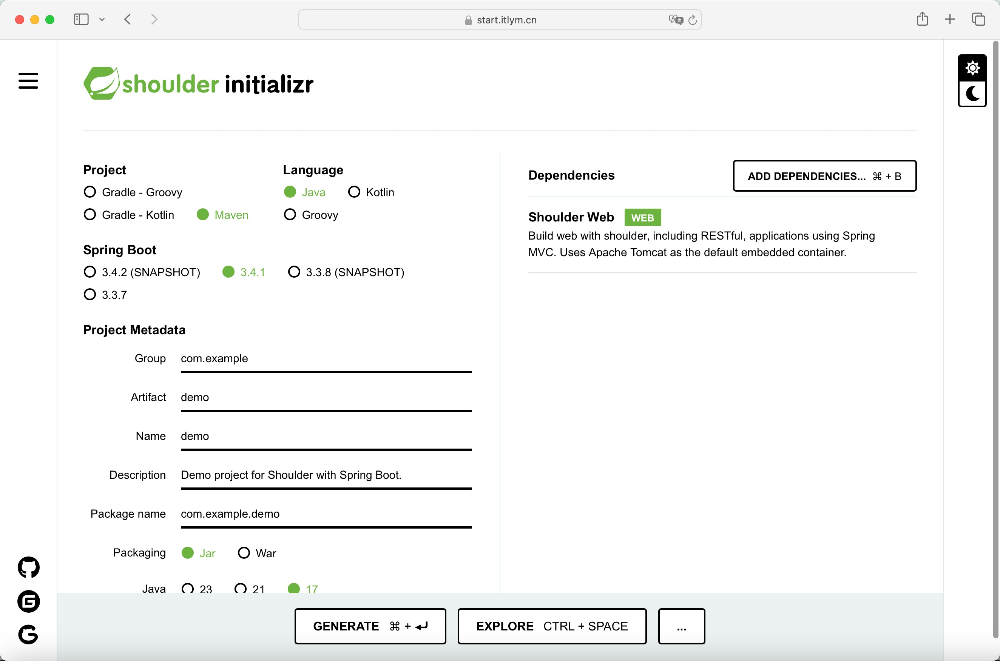
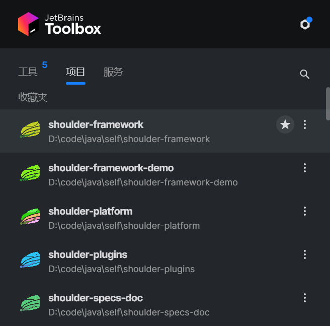

<h1 align="center"><a href="https://doc.itlym.cn/shoulder.html" target="_blank"></a></h1>

> 基于 `Spring Boot` 的增强工具，为简化开发、提高效率而生。希望成为 `Spring-Boot` 最好的搭档。

[](https://github.com/ChinaLym/shoulder-framework/blob/master/LICENSE) [](https://github.com/ChinaLym)


`⭐当前预览版本:` `1.0.0-M4`

[](https://github.com/ChinaLym/shoulder-framework/releases/tag/v0.8.1)
[](https://spring.io/projects/spring-boot)

# 📖介绍 [English language](README.md)

`Shoulder Framework` 是 `Spring Boot` 的插件，并提供了一些好用功能加速开发！ 部分功能举例：
- `AOP日志/异常处理`
- `一键切换集群模式`
- `日志追踪上报`
- `多语言`
- `全自动动态字典`
- `全局ID`
- `统一报文格式`
- `操作审计`
- `多种验证码`
- `异步上传、下载`
- `绝密通信`
- `内嵌式DB/Redis`

# 🚀 [快速开始](https://start.itlym.cn)

## ✨ **[通过示例工程体验](https://github.com/ChinaLym/shoulder-framework-demo/tree/main/demo1)**

下载后直接运行，快速感受 `Shoulder`的顺滑编码的魅力。
[github](https://github.com/ChinaLym/shoulder-framework-demo/tree/main/demo1) / [gitee](https://gitee.com/ChinaLym/shoulder-framework-demo/tree/main/demo1)

## 🔥 **[在线创建新工程](https://start.itlym.cn)**



## ✨ 在已有 `Spring-Boot` 工程中使用

`pom.xml` 中添加您需要的模块即可使用，如：希望使用`shoulder-web 的动态字典能力` ，则引入对应starter即可~

```xml
        <!--如希望使用 Shoulder 中 web 相关的能力增强，只需引入 web 模块-->
        <dependency>
            <groupId>cn.itlym</groupId>
            <artifactId>shoulder-starter-web</artifactId>
            <version>1.0.0-M4</version><!-- shoulder-version -->
        </dependency>
```

## ✈️ 通过 maven-archetype 创建新项目（需要 Maven）

通过 [shoulder-maven-archetype](https://github.com/ChinaLym/shoulder-framework/tree/master/shoulder-archetype-simple)，快速创建。

打开命令行，运行以下命令来生成新的 `Shoulder` 项目：

```shell
mvn archetype:generate -DarchetypeGroupId=cn.itlym -DarchetypeArtifactId=shoulder-archetype-simple  -DarchetypeVersion=1.0.0-M4  -DgroupId=com.yourcompany  -DartifactId=yourappName  -Dversion=1.0-SNAPSHOT
```

## 🧩 更多创建方式

> 手动创建、Spring CLI、IDEA、STS...

See in [doc.itlym.cn](https://doc.itlym.cn/shoulder_start.html])


---

# 🆚 对比其他 Web 框架

**更安全**、**更简单**：设计上遵循 **[软件优雅设计与开发最佳实践](https://doc.itlym.cn)** ，让使用者不仅开发提效，质量也更高！

# 🌛 适用场景

- `毕业设计`、`外包项目` ：基于提供能力飞速开发。
- `微服务基层框架`：`Shoulder` 设计时遵循编码规范，统一的编码界面和产物，让开发 / 运维团队轻松维护。
- `内部框架开发`: `Shoulder`设计时充分吸收`Spring Boot`的思想，注重可扩展，这使得一些希望构建内部框架的 公司/组织 可以快速二次为内部框架。

---

# ❓常见问题 & FAQ

### Q：是重复造轮子吗？
非也，`Shoulder`设计理念如命名——“站在巨人肩膀上”，不倡导重复造轮子，重在将“巨人的肩膀”（业界卓越的代码与设计）安全高效地带给使用者，让开发者放心地感受 “肩膀”的魅力🤩。

更多： [功能介绍.md](doc/ability-intro.md)、[工程目录 & 模块划分](doc/module-intro.md)、[设计理念 & 发展路线](ROADMAP.MD)

# ✈ 规划 & 发展路线

`Shoulder` 希望做一个整套的可复用的平台（`PaaS`），使用者只需要做做自己的业务即可。整体格局如下

- `Shoulder iPaaS` 基础中间件环境 Shoulder 提供依赖中间件的`Docker`镜像或部署教程（如 数据库、消息队列、服务注册中心、任务调度中心、搜索引擎、报警与监控系统等）。
- `Shoulder Specific` 软件系开发设计注意事项、[落地方案和规范](https://doc.itlym.cn)
- **Shoulder Framework**  本项目，提供共性能力封装，减少代码冗余，降低系统开发维护成本。
- `Shoulder Platform` 共性业务平台，提供 `用户平台`、`支付平台`、`通知中心`、`业务网关`、`数据字典`、`全局ID生产器` 等基础、通用业务能力平台
- `Shoulder Platform SDK` 以 sdk 形式方便业务层对接使用。

## 相关项目

| 项目                          | 开源地址                                                                                                                      | 说明                                                                                      |
|-----------------------------|---------------------------------------------------------------------------------------------------------------------------|-----------------------------------------------------------------------------------------|
| Shoulder Framework          | [github](https://github.com/ChinaLym/shoulder-framework)、[gitee](https://gitee.com/ChinaLym/shoulder-framework)           | 开发框架 / 在 Spring Boot Start 插件，结合[软件优雅设计与开发最佳实践](https://doc.itlym.cn)，增加常用的功能，助力高效开发。   |
| Shoulder Platform           | [github](https://github.com/ChinaLym/shoulder-platform)、[gitee](https://gitee.com/ChinaLym/shoulder-platform)             | `SaaS` 开发平台，提供了基础通用能力，与具体业务无关                                                           |
| shoulder-framework-demo     | [github](https://github.com/ChinaLym/shoulder-framework-demo)、[gitee](https://gitee.com/ChinaLym/shoulder-framework-demo) | 以简单的例子介绍 `Shoulder` 的使用                                                                 |
| shoulder-plugins            | [github](https://github.com/ChinaLym/shoulder-plugins)、[gitee](https://gitee.com/ChinaLym/shoulder-plugins)               | `Shoulder` 提供的 `maven`插件，构建时扫描代码注释自动生成多语言翻译文件，从而提效                                      |
| shoulder-lombok             | [github](https://github.com/ChinaLym/shoulder-lombok)、[gitee](https://gitee.com/ChinaLym/shoulder-lombok)                 | 同`lombok`，额外支持 `@SLog` 注解，`lombok`风格省略 `Shoulder` 扩展的 `Logger` 代码                       |
| shoulder-lombok-idea-plugin | [github](https://github.com/ChinaLym/lombok-intellij-plugin)、[gitee](https://gitee.com/ChinaLym/lombok-intellij-plugin)   | `IDEA 插件`，同 `lombok-idea-plugin`，额外支持`shoulder-lombok` 中的 `@SLog`                       |
| Shoulder iPaaS              | [github](https://github.com/ChinaLym/shoulder-ipaas)、[gitee](https://gitee.com/ChinaLym/shoulder-iPaaS)                   | `iPaaS` 平台，分享部署常见中间件步骤、如何自建监控系统、私有基础平台                                                  |
| Shoulder Start              | 未开源                                                                                                                       | [start.itlym.cn](https://start.itlym.cn/), 像 `start.spring.io` 一样，更方便地创建 `Shoulder` 项目。 |



# 📒 版本变更记录

见 [CHANGELOG.adoc](CHANGELOG.adoc)

# 💗 贡献代码

欢迎各类型代码提交，不限于`优化代码格式`、`优化注释/JavaDoc`、`修复 BUG`、`新增功能`
，更多请参考 [如何贡献代码](CONTRIBUTING.MD)

# 📩 反馈 or 联系我

感谢小伙伴们的 **[🌟Star](https://gitee.com/ChinaLym/shoulder-framework/star)** 、 **🍴Fork** 、 **🏁PR**，欢迎使用 `issue`
或 [cn_lym@foxmail.com](mailto:cn_lym@foxmail.com) 交流，如 留下您的建议、期待的新功能等~

`Shoulder` 不求使用最广，而致力于成为使用体验最好的开发框架，您任何的使用需求、建议、想法都可以留下来与我们沟通，`Shoulder` 将与您一起思考攻克疑难，助天下的开发者更好更安心得使用技术助力业务腾飞！

[问题排查指南](doc/faq.md)

### 👨‍💼 关于作者

多次参与 Alibaba 核心系统重构与设计，主导过多次 D11 级别大促保障，欢迎技术交流与简历投递～
- 该项目为作者在业余时间独立开发和维护的个人项目，非阿里巴巴官方产品。
