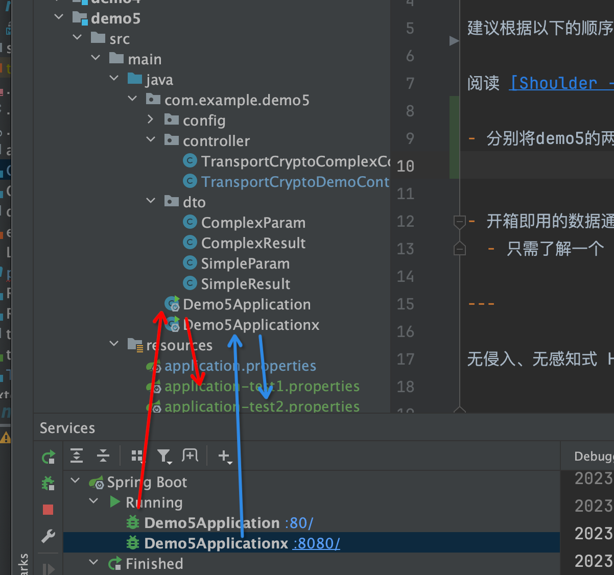

# 学习 **[shoulder-framework](https://gitee.com/ChinaLym/shoulder-framework)** - ECDH 与安全通讯

## 加密通信

建议根据以下的顺序了解 `Shoulder` 的使用

阅读 [Shoulder - 通讯加密方案](https://gitee.com/ChinaLym/shoulder-framework/tree/master/shoulder-build/shoulder-base/shoulder-crypto-negotiation)

- 分别将demo5的两个应用使用 test1、test2 两个不同的profile分别启动后才能进行测试
> 可以修改 application.properties 的 spring.profiles.active 属性启动

- 开箱即用的数据通信自动加解密
  - 只需了解一个 `@Sensitive` 注解，其他的 Shoulder 已经完成了

---

无侵入、无感知式 HTTP 通信加密，且为了便于满足不同国家的政策监管，通过注入对应的加密类即可切换加密算法，如中国要求 SM 算法、美国要求AES算法。

