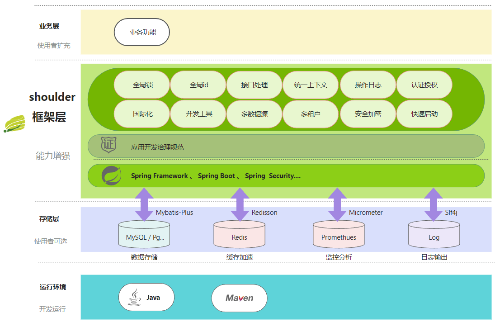

# 功能介绍

- `Spring Boot`一致的风格和使用体验
    - maven 工程模块命名为 `Spring Boot` 官方唯一指定风格
    - 一处配置，处处默认：如字符集、语言、日期格式等，无需 `session.store.cluster=true crypto.store.cluster=true token.store.cluster=true` ，仅需统一指定 `application.cluster=true`，一配置切换至集群模式，无状态化
    - 约定大于配置，配置生效优先级：`显式模块级配置 > 显式全局级配置 > 模块默认值 > 环境变量 > 系统默认值 > 未设置`）
    - 体验同`Spring Boot`，就像`Shoulder`不存在一样，只有 `starter` 和几个配置，但节省了巨大工作量。
-
- 错误码（契约精神）
    - 错误可通过错误码溯源，提供表意、传递、追踪机制
    - 与日志记录、链路追踪、接口契约、消息传递打通，有全局自动化兜底处理机制

- 日志、异常（周到全面的异常设计）
    - 基于业界标准的日志标准（base on `Slf4j`），无兼容问题，最小化配置、开箱即用，优化内部并发机制，并结合shoulder技术栈提供增强能力
    - `日志`、`异常`、`错误码` 打通、改造了 `lombok` 源码，提供简化开发注解，极大减少代码量
    - 统一错误码格式（也支持配置）、规范代码中的错误
    - 提供错误码实践方案，让 `错误码规范` 不在头疼
    - 提供全局`异常`、`错误码`处理

- 操作/审计日志（周到全面的溯源审核设计）
    - 基于注解的使用：一个注解简单上手
    - 可扩展的输出格式：便于统一日志规范、提供默认推荐格式
    - 可扩展的目标源：无论是打印日志、保存至数据库、发送至Kafka，ELK等
    - 可扩展的记录流程：灵活编排记录步骤、动态填充
    - 日志策略上下文：自定义日志上下文传递方案，借鉴 Spring 的事务传播机制
    - 自动跨线程支持：异步业务场景，也不需要担心如何将一些变量跨线程传递
    - 异步与缓存：支持高并发场景异步与批量记录，提高系统的吞吐量

- 国际化与多语言翻译
    - 丝滑的翻译封装：在 Spring MessageSource 之上，添加了动态获取当前语言的方法
    - 完善的多语言支持：支持多种多语言文件存放规则，除spring/jdk默认的、以及基于语言标识目录名

- 完备的 session 管理
    - 包含存储、分析

- 先进完备的加密与安全
    - 不像其他第三方 jar ，仅提供只提供 `AES\RSA\ECC\SHA\MD5` 等公开算法的实现。`Shoulder`
      还在这之上提供了`安全` `可靠` `可生产落地` 的方案与实现，如 `多级密钥管理`
      、`加密算法平滑升级`
        - 安全本地存储加解密：LocalCrypto，仅本应用/服务可以解密
        - 可配置的非对称密钥端点：无论是 `RSA`、`ECC` 还是国产化的 `SM2`，通过配置即刻实现切换；设置为集群时，自动将密钥存储转移至redis
        - 数字摘要算法（哈希算法）、抗抵赖的签名算法
        - 简化使用的统一接口：不仅仅 byte[] ，也可以 String、Input/OutputStream 的加密
        - 大数据并行加解密：充分利用计算资源，提升加解密性能
        - 便于快速上手的门面工具类：只需要知道几个静态方法即可使用
        - 基于 `ECC`（可替换） 的密钥协商实现，提供了完整的密钥协商逻辑并在 spring boot 中自动激活
        - 安全传输方案（基于 `注解` ，无感知密钥协商，极简使用）

- 通用业务代码封装
    - 数据库封装，如枚举与字段转换
    - 基本业务封装，增删改查系列

- 校验框架
    - 基于 `JSR` 规范，实现更多常用校验规则
    - 与异常、错误码、多语言打通，简化开发难度
    - 包含文件、熟悉、DTO

- WEB 认证 & 安全
    - 常见 `WEB` 攻击的防御器：CSRF、XSS、SQL Inject
    - Oauth2 授权
        - 认证服务器、资源服务器等（扩展 `Spring Security` ）
    - 充分灵活的认证框架（扩展 `Spring Security` 迁移自 [learn-spring-security](https://gitee.com/ChinaLym/learn-spring-security)）
    - 灵活可配置的验证码框架：只需一行配置，即可在任意接口增加验证码校验，极大提高代码复用度
    - 快速实现认证中心：`OAuth2`、`JWT Token` 发放、鉴权、认证、JWK端点、自定义的认证方式、支持 `SSO` 单点登录
    - 灵活的认证方式切换：一行配置在 Session、集群 Session、Token、JWT Token

- 依赖管理 & 开箱即用
    - 与 `Spring Boot` 类似，无需再思考引入哪个版本，会不会冲突，`Shoulder` 管理了常用依赖的版本号，如 `spring-boot`、`spring-cloud`、`spring-cloud-alibaba`
  - 自动依赖，当您引入 `shoulder-starter-web` 不需要再引入 `spring-boot-starter-web` 也不需要担心还要依赖什么
    - 最小化配置，提供了默认的配置项，自带建议配置。
    - 配置项支持 `IDE` 的自动提示

- 更多
    - **Java中性能最高**、灵活配置的**分布式、全局递增、唯一标识生成器（单节点持续高压场景为 twitter 雪花算法**200w倍+**、JDK UUID的 **120倍！**、百度开源算法的近 **60 倍！**）。
      巧妙处理时钟回拨，突发峰值、持续高压，并支持配置与扩展。
    - 可扩展的生产级分布式锁：优雅处理持锁宕机、并发加锁、可重入；默认支持数据库（巧妙处理事务可见性）、内存（提供模拟器）、Redis、zookeeper...
    - 可扩展的延迟任务
    - 几乎去SQL开发的设计
    - 类型转换（枚举 - int - String - json 自动互转、各类时间格式互转）
    - 可动态调节，具备监控能力的线程池
    - 灵活的多环境配置
    - 标准可扩展的链路追踪（`Open Tracing`）
    - 认证、注册、权限管理
    - 分布式的任务调度
    - 与 Spring Boot 天衣无缝的自动集成能力
    - 能力保证可扩展、可监控、可回滚（单独屏蔽下线）
    - 提供使用demo、部分单元测试：提供优秀的应用案例，懒人可以直接复制代码即可。
  - **待您探索...**
