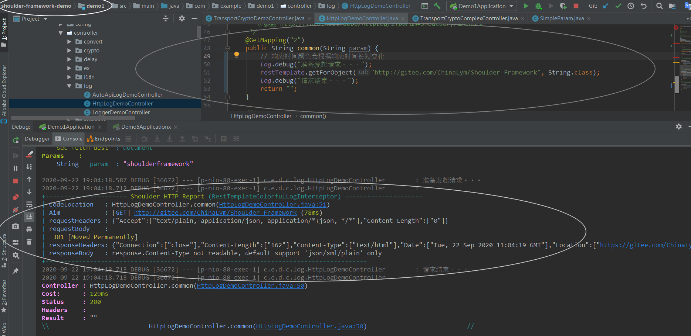

# 接口调用入参出参记录.MD

不需要任何配置即可使用，该文档只是功能说明。也可以下载 shoulder-demo 运行 demo1 查看效果

## 作为服务提供方

### 彩色格式打印

`shoulder.http.log.type=colorful`（默认）

`RestTemplateLogAutoConfiguration`

### JSON 格式打印

`shoulder.web.log.type=json`

## 作为请求方

### 彩色格式打印

`shoulder.web.log.type=colorful`（默认）

`RestTemplateLogAutoConfiguration`

### JSON 格式打印

`shoulder.http.log.type=json`

---

- 开发模式推荐使用彩色格式
    - 彩色模式带格式化、换行、代码位置跳转、给代码添加点色彩，调试方便，根据响应时间输出不同颜色
- 生产环境使用 JSON 格式以方便收集日志
    - 使用 JSON 格式记录更利于存储、方便日志收集，如`ELK`，并剔除了获取代码位置等可能降低吞吐的操作
