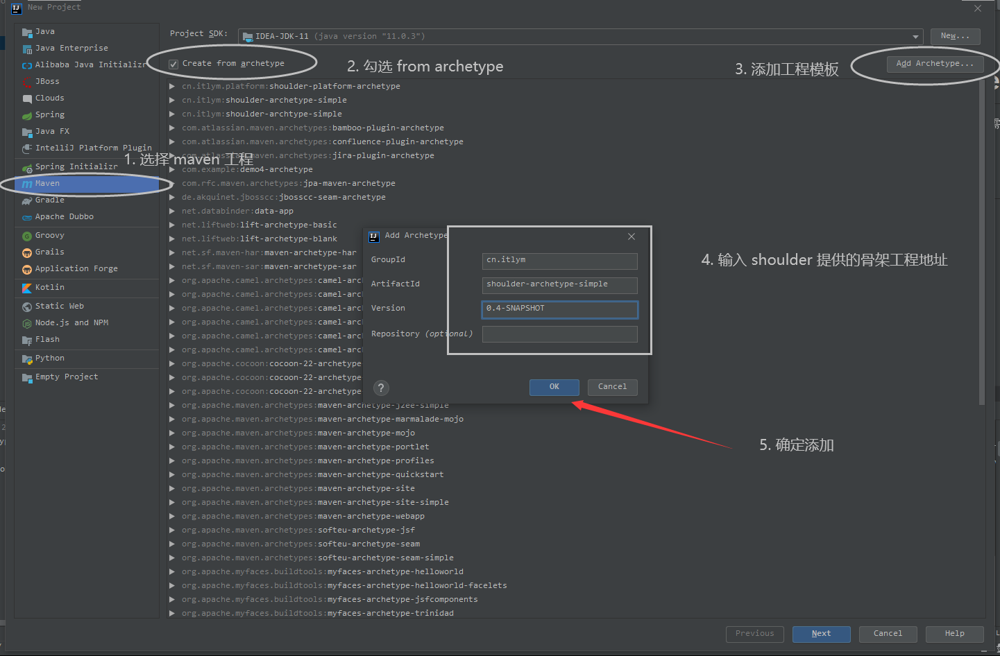
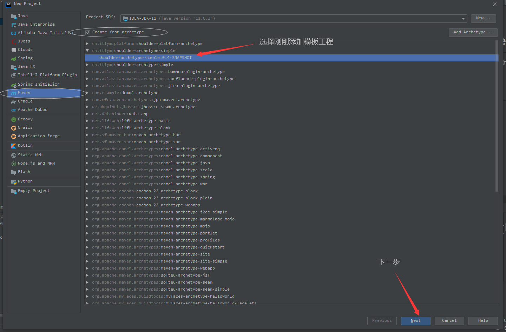
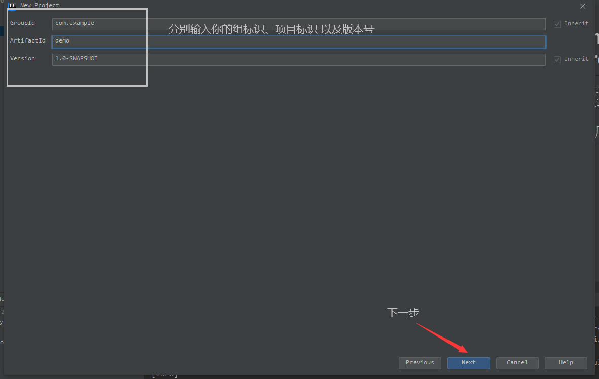
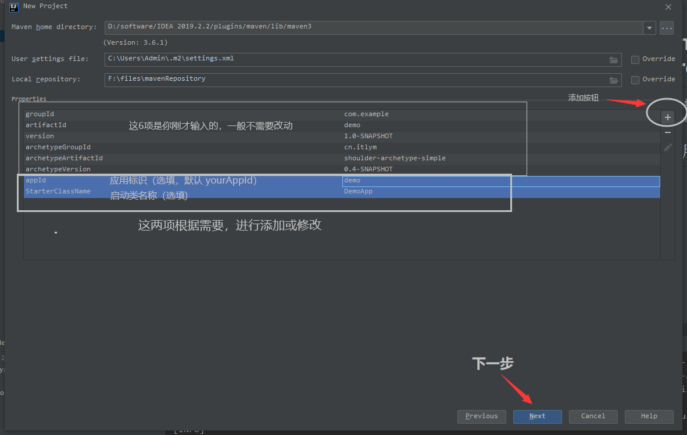
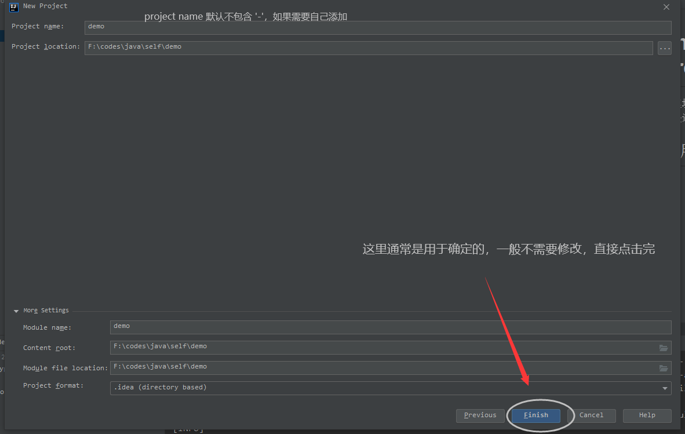
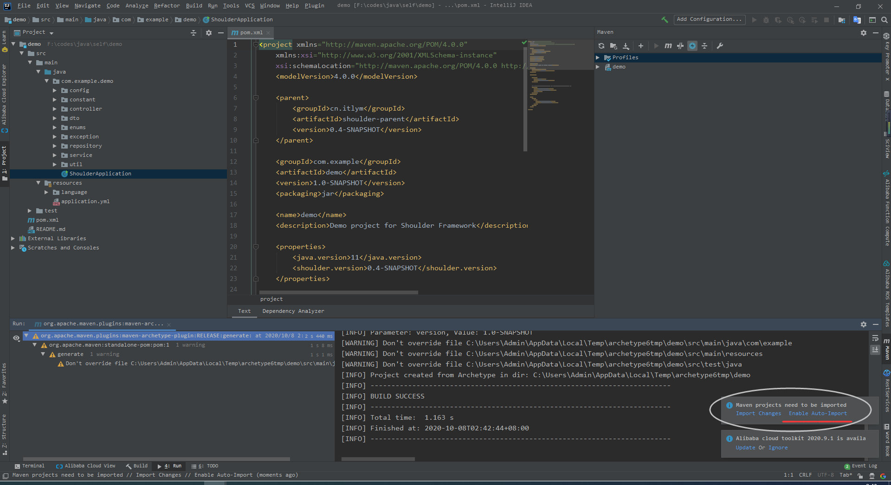

# [shoulder-archetype-simple](https://github.com/ChinaLym/shoulder-framework/tree/master/shoulder-archetype-simple)

单模块的 `maven` 骨架工程，适合微型或需要快速迭代的项目，如课设、毕设等

## 诞生背景

微小型项目是最最常见的，多见于课设、毕设等，由于依赖少、代码少，构建迅速，不需要maven的`聚合`、`继承`的特性，创建这类工程中繁琐的事情就是包目录结构定义、依赖管理，shoulder 提供该骨架工程加速创建。

## 保姆级使用介绍

下面以 IDEA 为例，介绍如何通过 `shoulder-archetype-simple` 快速创建一个引入了`shoulder`的 spring boot web 工程

### 添加 shoulder 的 archetype（仅第一次需要） 

第一次使用时需要添加，以后都不用这一步咯，除非调整 `version`

本次以 `0.8.1` 为例说明
```
groupId     cn.itlym
artifactId  shoulder-archetype-simple
version     0.8.1
```



---

## 基于 shoulder 提供的模板创建 maven 工程

### 方式一

通过命令行快速创建

```bash
mvn archetype:generate\
    -DarchetypeGroupId=cn.itlym\
    -DarchetypeArtifactId=shoulder-archetype-simple\
    -DarchetypeVersion=0.8.1\
    -DgroupId=com.foo -DartifactId=demo -DappId=demo\
    -Dauthor=shoulder -Dversion=1.0.0-SNAPSHOT\
    -B
```
创建一个工程，groupId=com.foo artifactId=demo，其中 appId、author 可选。

### 方式二

通过 IDE 一步步创建

#### 选择shoulder


#### 输入自己的 `groupId`、`artifactId`


#### 【可选】 调整模板的值
所有属性以及默认值见文末的 `模板属性表`


#### 点击完成


#### 等待创建完毕


- 这一步可能会特别慢，原因：未设置maven本地缓存，访问官网下载大量文件。解决方式参考 [IDEA 创建maven工程 create from archetype 很慢](https://blog.csdn.net/qq_35425070/article/details/108958087)
- 创建完毕后，我们需要 `reimport maven` 依赖，这里我们直接点击自动更新（`auto reimport`）

## 启动运行


可以访问 DemoController [http://localhost:8080/demo/test](http://localhost:8080/demo/test) 查看一下

---

## 模板属性表

|属性 key | 说明 | 默认值 |
|----|----|----|
| appId | 应用/服务标识 | 使用 `${rootArtifactId}` 值 |
| package | 包路径 | `${groupId}.${appId}` |
| contextPath | 上下文路径 | `${appId}` |
| StartClassName | 启动类名 | ShoulderApplication |
| author | 作者名 | shoulder |

