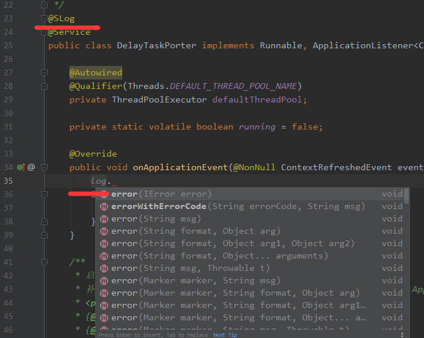
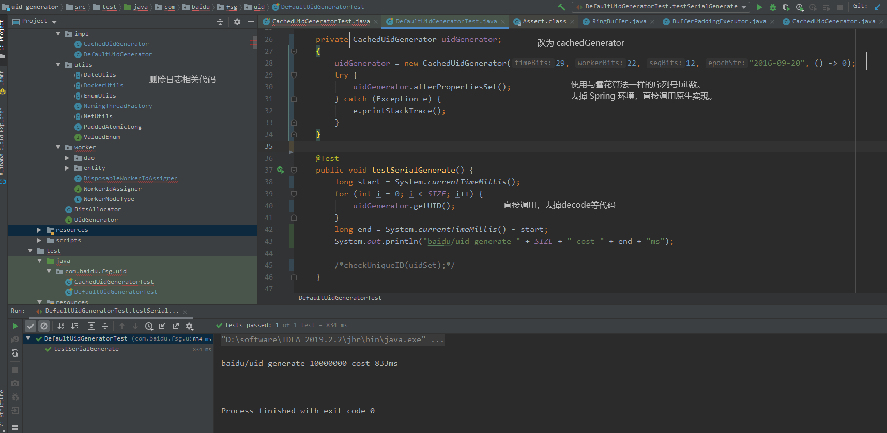
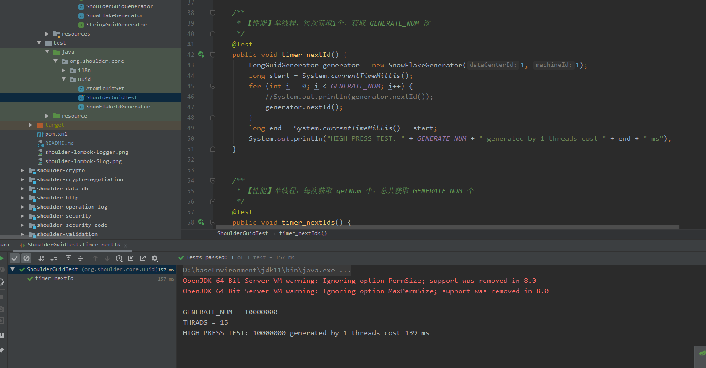
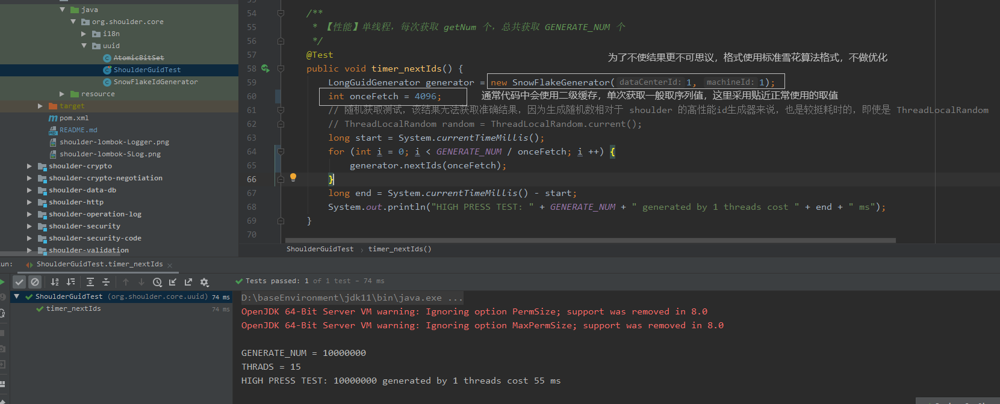
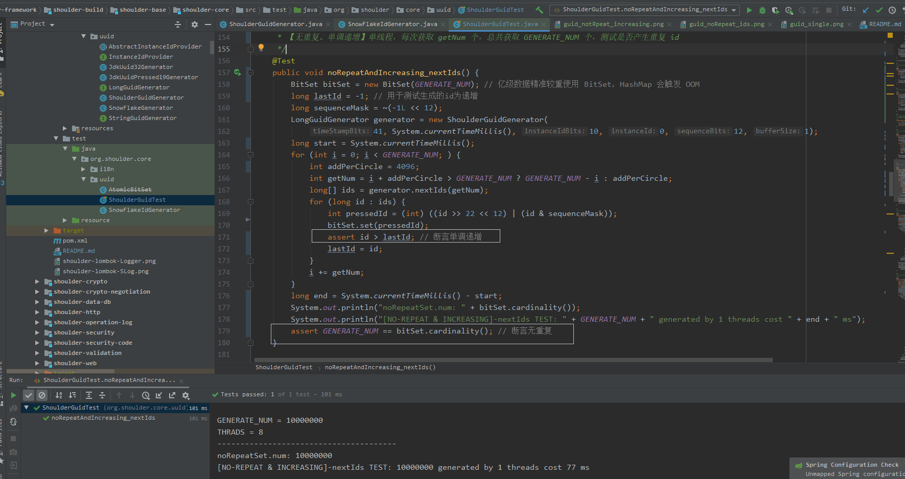
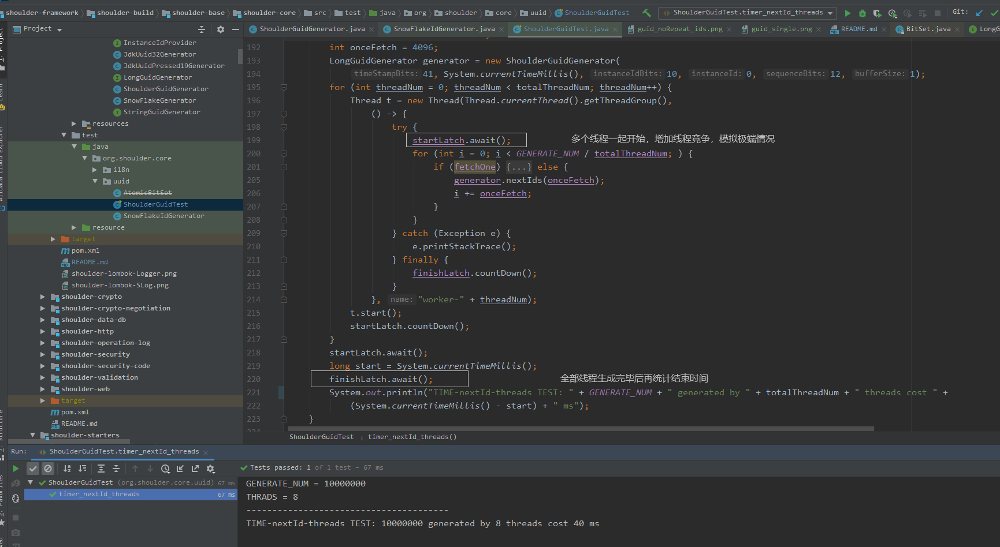

# shoulder-core

本框架定义的一些类，如异常、枚举、DTO(入参、响应)、通用工具等。

这些类为 shoulder 其他能力提供规范定义与约束，以保证使用该框架编写的系统易维护。

规范定义同业界主流保持一致。

## 异常、错误码、日志

异常类、错误码的使用需求：

- 定义了异常常量
    - 抛出
        - 需要填充参数（有默认值）
        - 不需要填充参数
        - 需要包裹上层异常
    - api 返回值
        - 需要填充参数 `"data": [参数1, 参数1, ... , 参数n]`
        - 不需要填充参数
        - 需要包裹上层异常
- 定义了异常类
    - 抛出
        - 需要填充参数（有默认值）
        - 不需要填充参数
    - api 返回值
        - 需要填充参数（有默认值）
        - 不需要填充参数
        - 需要填充 data（上层异常的msg）


其中响应为 4xx/5xx 类的错误码应直接抛出

异常需求：框架/工具类等可二次开发/使用的代码定义异常为检查异常，实现类/默认实现类需要定义带错误码的异常。

- 异常 带错误码
- 日期格式 yyyy-MM-dd
- 日志 支持记录带错误码
- HTTP RESTFUL 返回值

[spring boot 注解解释](https://www.cnblogs.com/lovecindywang/p/9846846.html)


## 简化异常日志处理

Shoulder 提供了 [shoulder-lombok](https://github.com/ChinaLym/shoulder-lombok)（在 lombok 的基础上扩展了 shoulder 日志注解 `SLog`），使用效果如图



- 与 `@Slf4j` 类似，如果类内部已经定义，IDEA也会有提示，且可以通过编译。使用注解将在编译时自动生成类似以下代码


- 日志logger默认变量名为 log，当然也可以修改，若想修改则新建 lombok.config 文件，写入 `lombok.log.fieldName=xxx` xxx 为自己希望的名字，如 logger

也可以搜索 `lombok 修改log变量名`

引入方式
```xml
        <dependency>
            <groupId>cn.itlym</groupId>
            <artifactId>shoulder-lombok</artifactId>
        </dependency>

```

使用方式

```java

@SLog
class LogExample {

}
```

编译后实际代码


```java

class LogExample {
private static final org.shoulder.core.log.Logger log = org.shoulder.core.log.LoggerFactory.getLogger(LogExample.class);

}
```

> 注：IDEA 中自动提示需要安装 [shoulder-lombok-plugins](https://github.com/ChinaLym/lombok-intellij-plugin)

---


## 翻译与多语言

#### Spring 多语言文件命名限制
 由于采用了 jdk 定义的 `ResourceBundle` 的思想加载多语言文件，故对多语言资源文件命名有 `ResourceBundle` 命名限制
 
#### Spring 的资源文件加载顺序
默认共尝试加载7处
- 按照传入 Locale，从详细到粗略加载一轮
    - 【资源名_语言_地区_变种】
    - 【资源名_语言_地区】
    - 【资源名_语言】
- 使用当前操作系统语言再次尝试加载一轮
    - 【资源名_语言_地区_变种】
    - 【资源名_语言_地区】
    - 【资源名_语言】
- 使用不带语言标识加载一次

翻译场景推荐 注：Thymeleaf、FreeMark 等动态页面由后端翻译，html静态页面或前后分离时推荐由前端翻译
 * 若有大量重复 message 映射时，如多租户，每个租户可以定制自己的界面和提示信息，可采用继承方式简化多语言管理

----

# [GUID（全局唯一标识符生成器）](https://github.com/ChinaLym/Shoulder-Framework/tree/master/shoulder-build/shoulder-base/shoulder-core#guid%E5%85%A8%E5%B1%80%E5%94%AF%E4%B8%80%E6%A0%87%E8%AF%86%E7%AC%A6%E7%94%9F%E6%88%90%E5%99%A8)

TODO shoulder-guid 文档补充

## 各家类雪花算法性能对比

- 参与 pk 算法：`Shoulder-guid`、`百度的 uid-generator`、`美团的 leaf` / `网上流传最广的 "高性能雪花算法Java实现"`

> BTW [滴滴 tinyId](https://github.com/didi/tinyid.git) 仅实现了号段模式，更新号段依赖外部存储（默认 mysql），执行速度远远不如类雪花算法，不做比较。

- 测试目标：比较类雪花算法的生成性能（网上流传版本/美团版本/百度魔改版本）。

- 测试机器：对比环境均为 `3700X` `16G` `DDR4 3000`。

- 测试方式：去掉所有日志、统计等无关代码，仅保留原生代码，生成 1kw 条id，执行10次，非完全精确测试，所有测试均未预热。

### JDK-uuid

`UUID.randomUUID().toString().replace("-", "");` 单线程大概需要 5700ms，8线程需要 6214ms（少量竞争）


### [美团-点评 leaf](https://github.com/Meituan-Dianping/Leaf) / 网上流传的最多`"高性能雪花算法java实现"`的代码

美团开源项目中提供了 twitter 的雪花算法的Java实现，和网上流传的最多`"高性能雪花算法java实现"`的代码基本相同，由于未作预支策略，每秒生成固定为 4096。不支持配置。

不支持时间回拨、生成 1kw 条需要半个多小时。

#### 结论

twitter 首个提出 GUID 的可行方案，该算法容易理解，为进一步了解 GUID 做了基础，最广泛流传的代码最简单，可以作为学习 GUID 算法的第一步。

但其默认无法处理时钟回拨，且其性能有效，即使加上时间预支、使用逻辑时钟，也还需要处理变量同步、变量共享、多变量原子操作，读写冲突等问题，不太推荐大规模生产环境中使用。

### [百度 uid](https://github.com/baidu/uid-generator)

官方号称每秒生成接近 700w，由于我电脑配置好于标注的性能配置，我认为在我电脑上百度算法的性能会更高，在自己电脑测试大概为 `1100w/s`，具体见下。

测试方式：使用官方号称最快的 CachedUidGenerator，去掉所有日志打印代码，去掉spring运行环境，只保留纯原生生成相关代码，序列位与标准雪花对齐，使用12bit

#### 测试 & 结果：

- 单线程运行需要 850-900ms 左右，且有概率因为获取过快出现异常（默认的逻辑，可自行改为阻塞）。



- `8`线程生成时需要 2300-2350ms 左右（由于竞争带来的性能下降）

#### 小结

百度提出了利用逻辑时钟 + 启动时机器号从外界获取不会重复唯一标识来解决时钟回拨，利用双 buffer，去伪共享，异步预填充机制降低并发读写同步带来地性能影响，保证了较高性能，但在超大规模场景还有待提升。

### [ShoulderGuid](https://github.com/ChinaLym/Shoulder-Framework/blob/master/shoulder-build/shoulder-base/shoulder-core/src/main/java/org/shoulder/core/uuid/ShoulderGuidGenerator.java) （Shoulder Globally Unique Identifier 全局唯一标识符）

测试代码见单元测试，与其他开源实现相比，除了提供`递增`、`唯一`的 `GUID` 算法与文档外，shoulder还有完善的[单元测试（性能、重复测试、扩展测试、多线程测试）](https://github.com/ChinaLym/Shoulder-Framework/blob/master/shoulder-build/shoulder-base/shoulder-core/src/test/java/org/shoulder/core/uuid/ShoulderGuidTest.java)

#### 测试 & 结果：

采用标准的雪花算法模式，未选用性能更高的配置

- 1. 单线程运行需要 135ms 左右，性能是百度算法的 **300 %** 倍。


- 2. 单线程**批量生成**需要 55ms 左右，性能是百度算法的 **1800 %** 倍。


> 为了证明 `Shoulder` 是高性能不是"投机取巧"换来的，特附 `shoulder-guid` 生成id是的`单调递增``无重复`的测试图证明。
>这 1kw 个id是无重复的，完全单调递增的！你可能 Shoulder-Guid 的高超性能感觉惊讶，没错！学 Shoulder，带你认使高并发！


- 3. `8`线程生成需要 335-360ms 左右（由于竞争带来的性能下降，CAS导致范围波地较大），性能是百度算法的 **660 %** 倍。


- 4. `8`线程**批量生成**需要 40ms 左右，性能是百度算法的 **5810 %** 倍。（多线程虽然增加了并发冲突因素，但由于CAS冲突减少，且并发获取，多线程获取整体耗时减少）【精髓】


Shoulder 提供了**批量生成**方式，并对批量获取id做了额外的算法优化，使用时一般会通过二级缓存调用批量方法，因此主要关注第 2/4次的批量获取测试结果即可。

#### 小结

shoulder-guid 将各个 bit 段支持可扩展，可以根据自己的业务场景变更 guid 格式。

shoulder-guid 利用了时间预支解决了单时间段序列达到上限问题，利用 buffer 缓存解决时钟回拨问题，利用CPU cacheLine 减少内存访问，多个点巧妙利用 CAS 制去掉了锁，实现真正地无锁化、高性能！

采用标准的雪花算法格式与其他实现做对比，而未对bit段参数调优，就已经远超其他实现，实际通过调优还可以翻倍获取更高的性能，至此，`shoulder-guid` 成为当之无愧的 `GUID` 性能王！

#### 扩展

* 在大多数业务场景下，不必过于在意 guid 算法的性能，优化后的号段模式基本够用了，作者更推荐关注各算法对于序列超拿、时钟回拨的处理，可扩展性以及高可用方案。

* 在海量日志分布式入库、大规模事件处理、分布式爬虫数据整理、大数据处理场景推荐使用 `shoulder-guid`，它性能最高、扩展性较好、可自由替换处理时钟回拨策略，留有监控的扩展点。

* 具体采用哪种方案应按照业务量体裁衣，根据不同业务场景，选用不同的生成方式。
** 比如业务上希望id存储空间对计算机更友好，则考虑使用 int32/int64 类型存储，优先考虑号段模式、类雪花算法。
*** 除此之外，还希望能在id中解析出时间戳、高性能，推荐使用雪花算法分布式生成，如日志id，调用链标识。
*** 若不要求id中有时间相关、且希望号段紧密的非敏感业务，可使用号段模式，如系统内部的记录。

* 若业务中希望流水号是随机生成，且保留靓号，可以采用分段预生成+随机存储策略，如用户id。

* 若业务场景中希望流水号更简短，方便客服反馈交流更方便，推荐使用 Base16 / Base 36 / Base 62 编码后使用，显示时分段展示并提供快速复制功能，保证看起来或者读起来更顺畅，如错误码、订单号。


---


