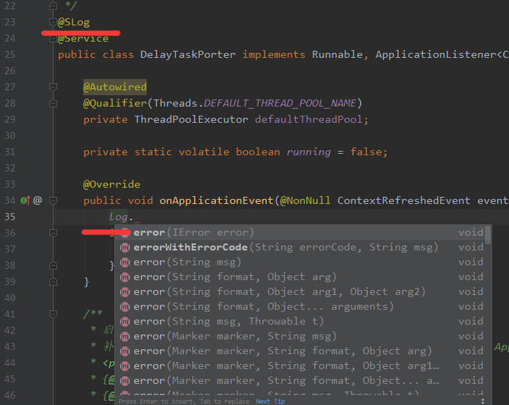
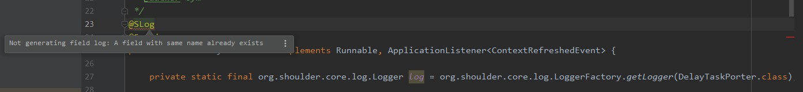

# shoulder-core

本框架定义的一些类，如异常、枚举、DTO(入参、响应)、通用工具等。

这些类为 shoulder 其他能力提供规范定义与约束，以保证使用该框架编写的系统易维护。

规范定义同业界主流保持一致。

- 异常 带错误码
- 日期格式 yyyy-MM-dd
- 日志 支持记录带错误码
- HTTP RESTFUL 返回值

这里引入了 shoulder-lombok ，在 lombok 的基础上扩展了 shoulder 日志注解 `SLog`，使用效果如图



与 @Slf4j 类似，如果类内部已经定义，IDEA也会有提示，生成完整的类名如下



日志logger默认变量名为 log，当然也可以修改，若想修改则新建 lombok.config 文件，写入 `lombok.log.fieldName=xxx` xxx 为自己希望的名字，如 logger

也可以百度或者谷歌 `lombok 修改log变量名`

引入方式
```xml
        <dependency>
            <groupId>cn.itlym</groupId>
            <artifactId>shoulder-lombok</artifactId>
        </dependency>

```

使用方式

```java

@SLog
class LogExample {

}
```

实际上编译后


```java

class LogExample {
private static final org.shoulder.core.log.Logger log = org.shoulder.core.log.LoggerFactory.getLogger(LogExample.class);

}
```

IDEA 自动提示需要安装 `shoulder-lombok-plugins`


---

异常类、错误码的使用需求：

- 定义了异常常量
    - 抛出
        - 需要填充参数（有默认值）
        - 不需要填充参数
        - 需要包裹上层异常
    - api 返回值
        - 需要填充参数 `"data": [参数1, 参数1, ... , 参数n]`
        - 不需要填充参数
        - 需要包裹上层异常
- 定义了异常类
    - 抛出
        - 需要填充参数（有默认值）
        - 不需要填充参数
    - api 返回值
        - 需要填充参数（有默认值）
        - 不需要填充参数
        - 需要填充 data（上层异常的msg）

其中响应为 4xx/5xx 类的错误码应直接抛出

[spring boot 注解解释](https://www.cnblogs.com/lovecindywang/p/9846846.html)
